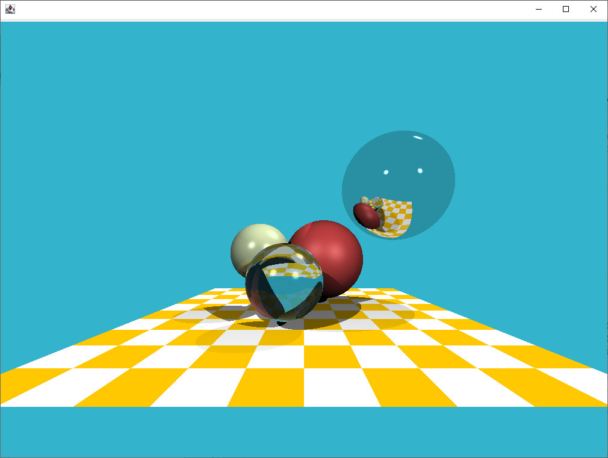

# A Java Ray Tracing Implementation  



This is a Java implementation of [tinyraytracer (C++) by ssoly](https://github.com/ssloy/tinyraytracer). This is a bit
fancier because of some extra abstractions. I wrote this useless piece just for self-study. If you are interested in 
understanding the fundamental concepts and mathematics behind ray tracing rendering (**it is surprisingly easy, I 
promise**), you should definitely check out the [WiKi page](https://github.com/ssloy/tinyraytracer/wiki) from the 
original project. Kudos to ssoly!  

Just to keep the tradition (following the original one), this project is also distributed under the [DO WHAT THE FUCK 
YOU WANT TO PUBLIC LICENSE](https://en.wikipedia.org/wiki/WTFPL).  

Bug reports and feedback are welcome! (If anyone does care.)

## A few notes of the code

* The final form of the implementation is based on my digest from the learning with adding a few more useless fancy
  abstract layers (gonna do it _OOP_). So while you can see some familiar code from the origin C++ project, my 
  implementation is still not a plain translation.

* The _main class_ is [`RayTracer`](src/main/java/personal/william/raytracer/RayTracer.java). Modify it if you want to 
  change the objects in the space or you want different ways of output (like file) or so on.

* While the positions, sizes and other properties of all the spheres do, or at least I try to, follow the corresponding 
  ones from the original project, it isn't the case of the floor plane. This is because 
  [the implementation](src/main/java/personal/william/raytracer/GridPatternParallelogramPlane.java) was done by what I 
  had already learned without looking at the original code, not even bother checking out the properties to match it. I 
  just tried my best to match them visually. 

------------------------------------------------------------------------------------------------------------------------

## Build

```shell script
mvn clean package
```

## Run

```shell script
java -jar target/tinyraytracer.jar
```

------------------------------------------------------------------------------------------------------------------------

## TODO...?

* Maybe finish the home assignments?

* Implement the "Stereo Rendering" from Part-2? (Not really interested in this part though.)
